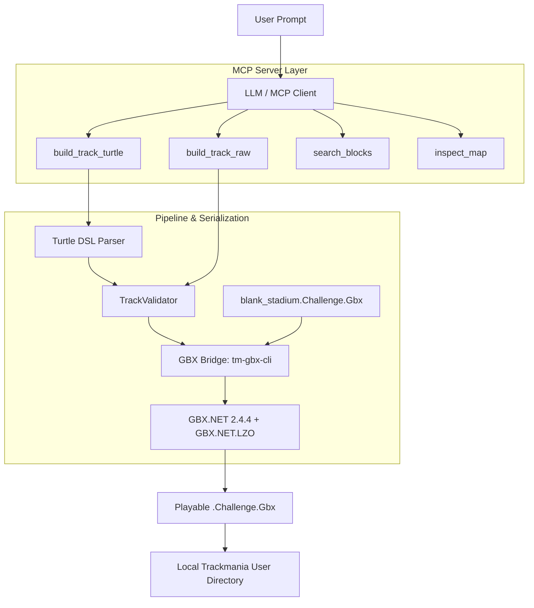

# Trackmania GBX MCP Server & Map Generator (Experiment)

> [!WARNING]
> **Status: Experimental Prototype / Proof of Concept**  
> This project was an exploratory experiment testing whether LLMs can construct valid Trackmania maps using the Model Context Protocol (MCP) and [GBX.NET](https://github.com/BigBang1112/gbx-net).
> 
> **Output Quality & Limitations:**  
> In its current state, map generation is **very basic and mostly unviable for competitive or realistic driving**. Because no RAG system or contextual few-shot libraries were implemented (providing pre-built modular segments such as proper loopings, dirt transitions, banked wallrides, or calculated jumps), the LLM generates naive, linear block sequences without spatial momentum, car physics, or landing height validation.
> 
> This repository serves primarily as an architectural demonstration of GBX binary serialization via C#, a relative Turtle DSL parser, and MCP tooling for Trackmania Forever (`.Challenge.Gbx`).

[](https://opensource.org/licenses/MIT)
[](https://github.com/BigBang1112/gbx-net#license)
[](https://nodejs.org/)
[](https://dotnet.microsoft.com/)
[](https://modelcontextprotocol.io/)

---

## Overview

Large language models struggle with generating 3D voxel and grid-aligned track structures when prompted for absolute world coordinates. This project addresses the translation pipeline through three primary components:

1. **Turtle Track DSL:** A relative movement engine (`start -> forward -> slope_up -> turn_right -> checkpoint -> finish`) that abstracts coordinate math, heading vectors, 2x2 curve footprints, and height offsets.
2. **C# GBX Bridge (`tm-gbx-cli`):** Integrates with `GBX.NET` and `GBX.NET.LZO` to inject generated block arrays into a template Stadium map (`blank_stadium.Challenge.Gbx`) and serializes binary, compressed `.Challenge.Gbx` files.
3. **MCP Server:** Exposes map inspection, block catalog querying, validation, and track compilation tools to MCP clients (such as Claude Desktop, Cursor, or Antigravity).

---

## Technical Bottlenecks

If you are looking to build a viable generative map tool, several structural pieces are missing in this prototype:

- **Missing RAG / Few-Shot Retrieval:** The LLM only receives a raw list of block IDs and coordinates (`block_catalog.json`). It has no mechanism to look up compound track patterns (e.g., how an off-camber dirt transition connects to a road ramp).
- **Lack of Multi-Block Section Modules:** Realistic Trackmania maps consist of compound modules (curved wallrides, dirt drifts, technical chicane complexes). Without providing sample segments as structured context, LLMs default to disjointed straight roads and basic curves.
- **No Physics or Momentum Validation:** The built-in validator only verifies geometry (start/finish presence, simple coordinate overlaps). It does not simulate speed, trajectory, clearance, or landing vectors.

---

## Architecture



---

## Prerequisites

- **Node.js**: v20 or later
- **.NET 8.0 SDK**: Required for compiling the C# GBX CLI bridge (`tm-gbx-cli`)

---

## Installation & Build

1. **Clone the repository and install Node dependencies:**
   ```bash
   git clone https://github.com/cheatoskar/llm-trackmania-map-generator.git
   cd llm-trackmania-map-generator
   npm install
   npm run build
   ```

2. **Build the C# GBX engine:**
   ```bash
   cd tm-gbx-cli
   dotnet build -c Release
   cd ..
   ```

---

## Configuration (MCP)

To use the generator with Claude Desktop, Cursor, or Antigravity, add the server to your MCP configuration file:

**Claude Desktop Configuration Path:**
- **Windows:** `%APPDATA%\Claude\claude_desktop_config.json`
- **macOS:** `~/Library/Application Support/Claude/claude_desktop_config.json`

```json
{
  "mcpServers": {
    "trackmania": {
      "command": "node",
      "args": [
        "C:\\path\\to\\llm-trackmania-map-generator\\dist\\index.js"
      ]
    }
  }
}
```

### Available Tools

| Tool | Purpose |
| :--- | :--- |
| `build_track_turtle` | Builds a track sequentially using relative actions (`forward`, `slope_up`, `turn_right`, etc.). |
| `build_track_raw` | Compiles an explicit list of block names, orientations, and 3D coordinates. |
| `search_blocks` | Queries the indexed Stadium block catalog by keyword, type, or surface. |
| `inspect_map` | Reads an existing `.Gbx` track file and reports author metadata, block count, and block inventory. |
| `list_reference_maps` | Lists `.Gbx` files available in `data/reference_maps/`. |
| `export_to_game` | Copies a generated track directly to the local Trackmania user folder. |

---

## CLI Usage (Standalone)

You can run the compiler without an MCP client by supplying JSON definitions directly:

### 1. Build via Turtle DSL
```bash
node dist/cli.js turtle examples/turtle_track.json --export
```

### 2. Build via Raw Coordinates
```bash
node dist/cli.js build examples/simple_sprint.json --export
```

### 3. Inspect an Existing Map
```bash
node dist/cli.js inspect examples/AI_Turtle_Hillclimb.Challenge.Gbx
```

### 4. Re-index Reference Maps
Place `.Challenge.Gbx` files into `data/reference_maps/` and run:
```bash
npm run cli -- catalog
```
This parses the maps and updates `data/block_catalog.json` with extracted block types and frequency statistics.

---

## Track Formats

### Turtle DSL (`examples/turtle_track.json`)
```json
{
  "mapName": "Prototype Sprint",
  "author": "Experimental Builder",
  "startX": 16,
  "startY": 9,
  "startZ": 10,
  "initialDirection": "North",
  "steps": [
    { "action": "start" },
    { "action": "forward", "count": 3 },
    { "action": "slope_up" },
    { "action": "forward", "count": 2 },
    { "action": "checkpoint" },
    { "action": "slope_down" },
    { "action": "forward", "count": 2 },
    { "action": "finish" }
  ]
}
```

### Raw Block JSON (`examples/simple_sprint.json`)
```json
{
  "mapName": "Raw Coordinate Sprint",
  "author": "Experimental Builder",
  "blocks": [
    { "name": "StadiumRoadMainStartLine", "x": 16, "y": 9, "z": 10, "dir": "North" },
    { "name": "StadiumRoadMain", "x": 16, "y": 9, "z": 11, "dir": "North" },
    { "name": "StadiumCheckpointRingV", "x": 16, "y": 9, "z": 12, "dir": "North" },
    { "name": "StadiumRoadMain", "x": 16, "y": 9, "z": 13, "dir": "North" },
    { "name": "StadiumRoadMainFinishLine", "x": 16, "y": 9, "z": 14, "dir": "North" }
  ]
}
```

---

## Potential Improvements

To move this approach beyond a basic prototype:
1. **Curated Pattern Library (RAG):** Store verified compound sections (e.g., 180° dirt drift, wallride entries, standardized gap jumps) in a vector or relational store to provide contextual few-shot examples during generation.
2. **Spline-Based Pathfinding:** Generate the racing line as a 3D spline first, calculate curvature and elevation constraints, and snap matching blocks to the path.
3. **Automated Drivability Checks:** Run a headless physics or ghost evaluation agent to verify that generated maps are physically completable.

---

## License & Attribution

- **Project Code:** Licensed under the [MIT License](LICENSE).
- **[GBX.NET](https://github.com/BigBang1112/gbx-net) (by BigBang1112):**  
  - Core library (`GBX.NET`): **MIT License**
  - Compression library (`GBX.NET.LZO`): **GNU General Public License v3.0 (GPLv3)** (due to Oberhumer's LZO compression license requirements).  
  - *Note:* Because `tm-gbx-cli` depends on `GBX.NET.LZO` for writing compressed map data, compiled binaries incorporating this module are subject to GPLv3.
- **Model Context Protocol (MCP):** Developed by Anthropic, PBC.
- **Disclaimer:** Trackmania and Nadeo are registered trademarks of Ubisoft Nadeo. This is an independent, non-commercial community project and is not affiliated with or endorsed by Ubisoft or Nadeo.
